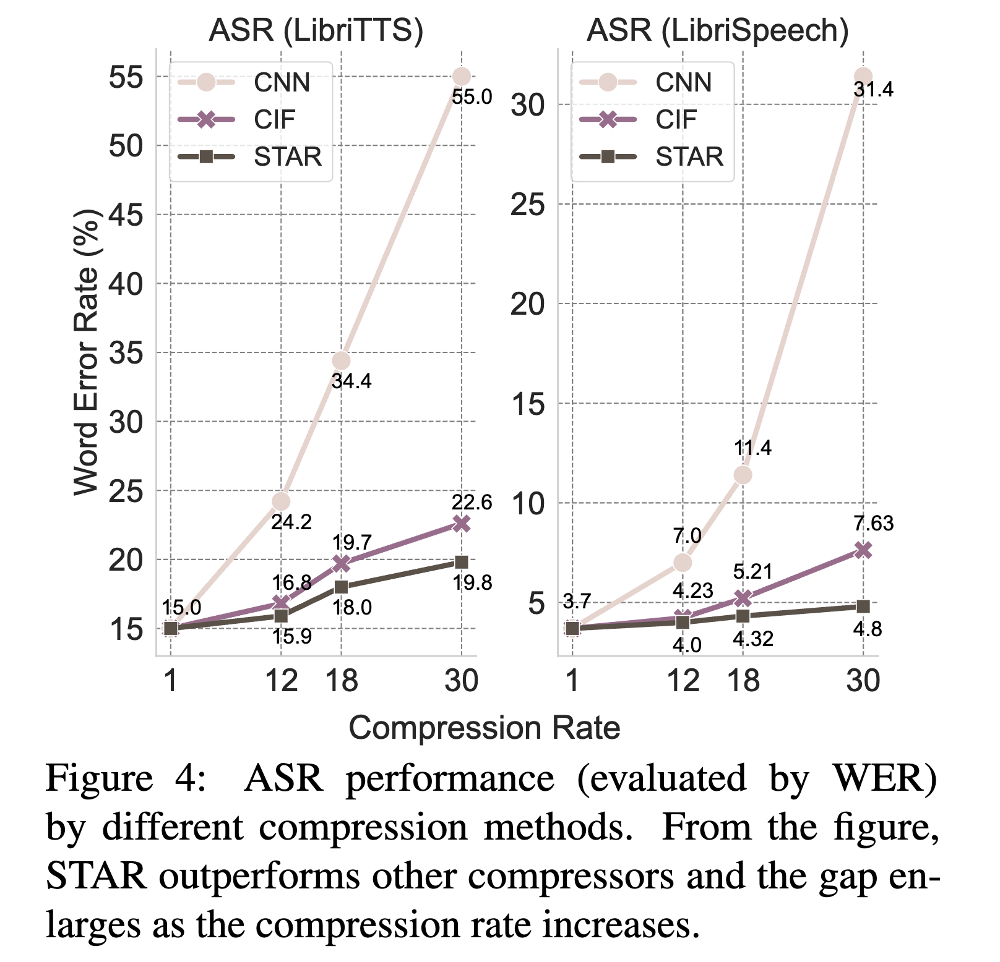
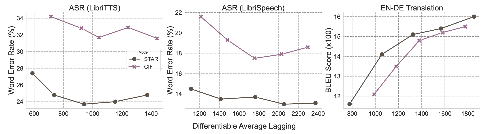

# [STAR: Speech Translation and Recognition Framework](https://arxiv.org/abs/2402.01172)
**Weiting Tan, Yunmo Chen, Tongfei Chen, Guanghui Qin, Haoran Xu, Heidi C. Zhang, Benjamin Van Durme, and  Philipp Koehn**

<p align="center">
<a href="LICENSE" alt="MIT License"></a>
<a href="https://arxiv.org/abs/2402.01172" alt="paper"></a>
<a href="https://www.clsp.jhu.edu/" alt="jhu"></a>
<a href="https://twitter.com/weiting_nlp">
  </a>
</p>

---

**STAR** is a research project that targets low-latency speech translation/transcription using a segmenter module learned from cross-attention feedback from Transformer Encoder-Decoder Model.


The project is built using [`poetry`](https://python-poetry.org/) for streamlined dependency management and reproducible environments. To install the environment, pull our codebase and run `poetry install` or you can setup your own env using conda and other tool by referring to our `pyproject.toml` config.

In this codebase, we refer to the module as **“nugget”** rather than “star.” This naming reflects our use of the cross-attention feedback mechanism first proposed in [Nugget: Neural Agglomerative Embeddings of Text](https://arxiv.org/abs/2310.01732), now extended to speech-to-text tasks.


## 🔧 Project Structure

```bash
STAR/
├── src/                     # Core source code
│   ├── train_simul.py       # Simultaneous S2T
│   ├── train_w2v.py         # Non-Streaming S2T
│   ├── lightning/           # PyTorch Lightning trainer modules
│   │   ├── simul_trainer.py
│   │   └── wav2vec_trainer.py
│   ├── data_utils/          # Data loading and preprocessing
│   │   └── data_module.py
│   │   └── preprocess_{dataset}.py # data preprocessing script is left here
│   ├── models/              # Customized Transformer and CTC model Code
│   │   └── my_transformer.sh
│   │   └── my_wav2vec.sh
|
├── scripts/                 # Example run scripts
│   ├── simul_s2t.sh         # Simultaneous S2T Entry
│   └── non_streaming.sh     # Non-streaming S2T Entry
|
├── pyproject.toml           # Poetry configuration
├── README.md                # Project overview
└── LICENSE                  # License information
```

---

## Experiments
### Non-Streaming Compression
In section 3 of our paper, we present non-streaming experiments. The training script can be found in `/scripts/non_streaming.sh` and the argument `  --nugget_compress_rate ` controls the compression rate. For details of the segmenter training, please track how `scorer_logits` are updated in [my_transformer.py](https://github.com/steventan0110/STAR/blob/main/src/models/my_transformer.py#L117). 



### Simultaneous Speech-to-Text Experiments
The training script is provided in `simul_s2t.sh`. The training is overall very similar to non-streaming compression, except that we add regularization to the scores following CIF so that the number of activation is close to the number of target tokens. Infinite-lookback can be activated by setting `--use_ilk` to True.



---

### If you find our work useful, please cite:
```
@misc{tan2024streaming,
      title={Streaming Sequence Transduction through Dynamic Compression}, 
      author={Weiting Tan and Yunmo Chen and Tongfei Chen and Guanghui Qin and Haoran Xu and Heidi C. Zhang and Benjamin Van Durme and Philipp Koehn},
      year={2024},
      eprint={2402.01172},
      archivePrefix={arXiv},
      primaryClass={cs.CL}
}
```
